# 协作式机器学习隐私安全问题

## 联邦学习基本算法 Federated Learning

在传统的集中式机器学习和需要迁移数据的分布式机器学习技术中需要将数据移出本地使数据隐私不能得到保障，联邦学习是为了解决这一问题而提出的一种协作式机器学习技术，通过间接交换模型信息达到分布式协作训练的效果，在保证数据隐私性的同时实现了大规模数据共享。

### Federated Averaging （FedAVG）

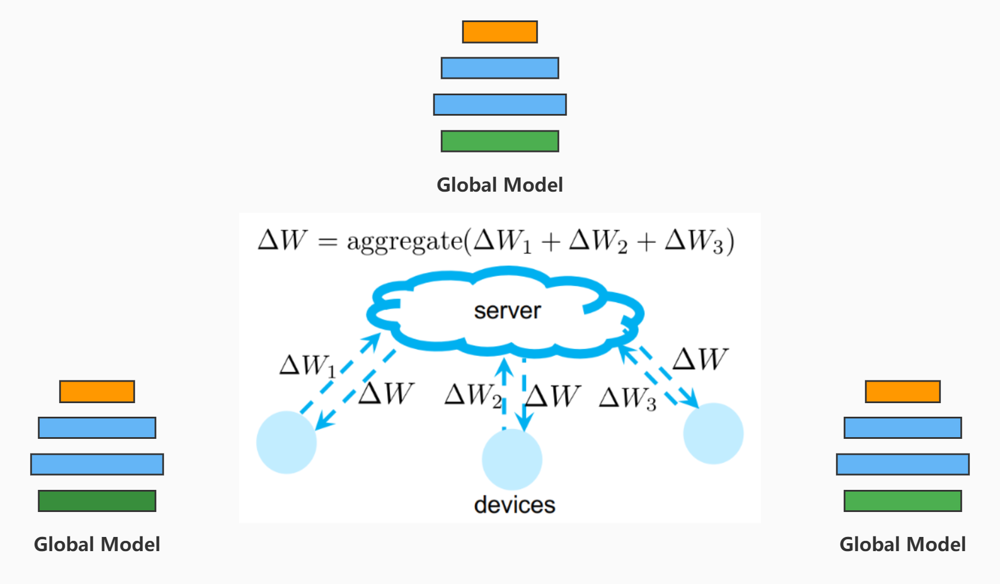

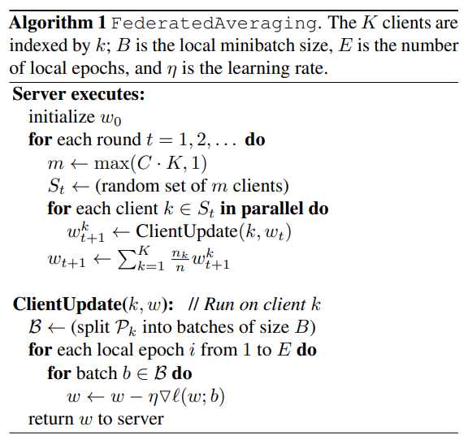

除了FedAVG[1]类似的优化算法还有FedSGD、FedOpt[2]、FedCD[3]等，其中FedSGD是将FedAVG中的权重平均改为客户端本地训练过程中一个batch中的梯度，在参数服务器上对梯度取平均。在联邦学习场景下通常假设不同客户端的数据分布是不同的，因此优化过程曲折。可以理解为东学学西学学等于没学的道理，在不同分布训练下模型产生的梯度可能相互抵消，这严重阻碍了较小局部最优解的寻找过程，同时优化算法还需要克服分布式环境下异构、失效的问题。

## 隐私保护联邦学习算法

## 针对联邦学习的攻击问题

联邦学习的安全性分析：针对联邦学习系统的攻击主要可以分为服务端攻击和客户端攻击。从服务端视角来看，在联邦学习中服务端拥有全局的模型结构，并且在每一轮聚合过程中可以得到每个客户端的梯度/参数信息也能得到最后的模型。虽然服务端不能直接得到客户端数据，但是可以通过模型参数反推得到客户端数据的一些属性信息，甚至可以恢复客户端数据。从客户端的视角来看，每次更新全局参数时客户端会获得所有客户端参数聚合的结果，这其中的参数信息就包含其他客户端的参数信息，因此恶意客户端可以通过排除自己的参数信息而获得其他客户端参数的平均值从而获得其他客户端数据信息。此外，客户端作为训练的参与者可以在训练过程中注入脏数据（毒化，如对抗样本、生成的假样本）从而影响甚至主导整个分布式训练过程得到意想不到的结果。

从安全防护的角度上看，针对联邦学习的攻击可以分为两种：一种是可以通过同态加密、安全多方计算等密码技术防御的信息泄露型攻击，比如服务端在获得全局模型后窥探客户端信息；另一种是密码技术不能防护的攻击，即恶意敌手参与训练过程、影响训练过程的攻击，比如恶意客户端注入毒化数据的攻击。

### 恶意客户端攻击

#### GAN-based Gradient Leakage Attack

##### Information Leakage from Collaborative Deep Learning[4]

###### Threat Model

敌手（恶意客户端）假装是联邦学习协议的诚实参与者，但试图提取不属于他的一类数据的信息。敌手还将暗中影响学习过程，以欺骗受害者使其发布有关目标类的进一步细节（窥探敌手没有的那一类的数据信息）。敌手正常参与联邦学习训练包括得知全局模型结构、参与模型聚合、服从参数服务器的参数选择、获得聚合后的模型参数，在诚实客户端视角里是正常的参与方客户端之一。[GAN implement]

###### Method

假设受害者 *V* （其他客户端）的数据集包含两类数据，其标签为 [a,b] 敌手拥有该学习任务中普遍存在与数据集中的类别 b 和虚拟构造的数据类别 c 。敌手没有关于 a 类数据的信息，但知道整体训练集中包含 a 类数据（因为敌手知道全局模型结构），敌手的目的是获取关于 a 类数据的信息，这里指重构图像数据。攻击过程中敌手试图用生成对抗网络（GAN）生成假冒的 a 类数据并打上 c 类标签，将假冒的 c 类数据和正常 b 类数据一同当作数据集数据参与训练，整个过程敌手保持动态生成假冒数据的过程，通过这种方式从诚实客户端窥探数据信息，影响训练过程。

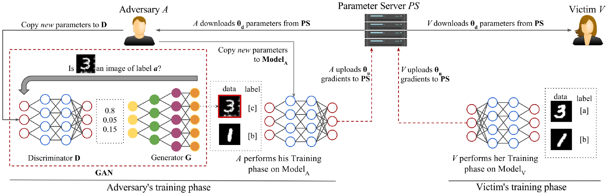

1. 诚实客户端持 [a,b] 类数据参与训练、敌手持 [b,c] 类数据参与训练
2. *V* 从服务器下载参数，在 [a,b] 上训练然后再上传训练后的模型参数
3. 敌手下载经 *V* 训练后的模型，训练生成对抗网络中的生成器 G
4. G 生成类似 a 类的数据并将其标记为 c 类，在 [b,c] 训练本地模型
5. 敌手上传本地训练过的模型参数参与聚合，包含 c 类伪造数据信息

这种攻击方式利用了参数聚合过程包含诚实客户端的本地训练的参数信息而这些参数信息又包含数据信息的特点，通过把全局作为判别器 D 分辨被攻击的 a 类数据，借助 D 在训练过程中每过一次参数聚合就会被诚实客户端增强的特点，带动生成器 G 生成的 a 数据分布进一步接近诚实客户端的 a 类数据分布最终模拟出客户端数据。将伪造数据设为自定义标签的而不是 a 类标签可以推进、引导诚实客户端在本地训练的过程中梯度往更能区分 a、c 类的方向下降，而这样梯度下降过程牺牲的是 a 类数据的更详细的信息，模型需要学习更细致的信息才能区分 a、c ，对应的就是判别器 D 的进一步增强，带动 G 增强。（当然把伪造数据打上 a 类标签也可以，这样会弱化 D 使得信息泄露变少）

###### Result

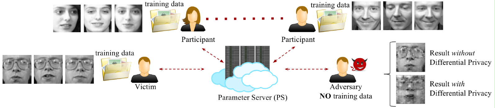

### 恶意服务端攻击

#### Gradient Information leakage from Malicious Server

##### Deep Leakage from Gradient[11]

在联邦学习过程中如果不对客户端上传的梯度保护（加密或加扰），那么服务器可以获得每一个客户端的经过若干个 local epoch 之后得到的模型权重或梯度，其中 local epoch 受非独立同分布影响一般不会设置很大可以是一个或几个 batch 。利用明文梯度和上一轮训练的模型，服务端尝试推理出本轮客户端产生该梯度的训练数据。

假设 local epoch = 1 batch，在$t$轮，客户端节点$i$从数据集采样 mini-batch $(x_{t,i},y_{t,i})$，计算 local batch 的梯度（batch 内的样本的梯度平均值）:

$$
\nabla W_{t, i}=\frac{\partial \ell\left(F\left(\mathbf{x}_{t, i}, W_t\right), \mathbf{y}_{t, i}\right)}{\partial W_t}
$$

Global epoch 全局优化可以表示为：

$$
\nabla W_t=\frac{1}{N} \sum_j^N \nabla W_{t, j} ; \quad W_{t+1}=W_t-\eta \nabla W_t
$$

$t$表示轮数，$j$表示客户端节点。

为了能利用梯度信息，服务端首先生成随机噪声作为数据和标签（$dummy$ $data$ $x^{\prime}$，$dummy$ $label$ $y^{\prime}$）,通过上一轮训练的模型计算得到 $dummy$ $gradient$:

$$
\nabla W^{\prime}=\frac{\partial \ell\left(F\left(\mathbf{x}^{\prime}, W\right), \mathbf{y}^{\prime}\right)}{\partial W}
$$

计算 $\nabla W^{\prime}$ 与 $\nabla W$ 差距反向优化（$x^{\prime}$，$y^{\prime}$）:

$$
\mathbf{x}^{\prime *}, \mathbf{y}^{\prime *}=\underset{\mathbf{x}^{\prime}, \mathbf{y}^{\prime}}{\arg \min }\left\|\nabla W^{\prime}-\nabla W\right\|^2=\underset{\mathbf{x}^{\prime}, \mathbf{y}^{\prime}}{\arg \min }\left\|\frac{\partial \ell\left(F\left(\mathbf{x}^{\prime}, W\right), \mathbf{y}^{\prime}\right)}{\partial W}-\nabla W\right\|^2
$$

优化方法采用基于梯度下降的优化方法，单步优化空间为 shape of（$x^{\prime}$，$y^{\prime}$），算法表示：

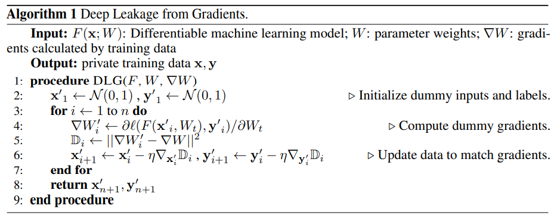

流程图表示：

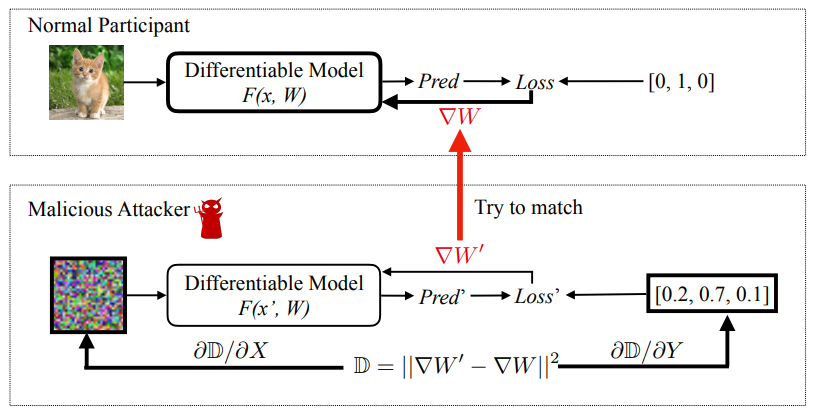

上述过程是在 batch size 为 1 的情况下的表示（FedSGD，batch size = 1），在 batch size 大于 1 时，服务端从标准正态分布中分别采样 batch size 个 （$dummy$ $data$ $x^{\prime}$，$dummy$ $label$ $y^{\prime}$）分别单独执行上述算法，优化第一个（$x^{\prime}$，$y^{\prime}$）若干轮后优化第二个。总的优化目标还是使 $\nabla W^{\prime}$ 与 $\nabla W$ 接近。

算法效果：（MNIST，CIFAR-100，SVHN，LFW）

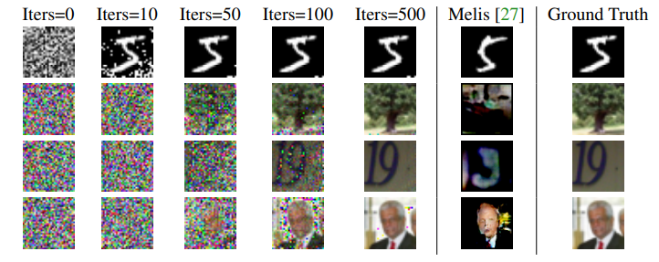

**存在的问题：** 当 batch size 很大时优化空间维度很大，基于梯度下降的优化方法难以应对。从优化过程上看优化 dummy data 与 dummy label 是单独进行的分别优化边缘分布 $P(x)$, $P(y)$，然而实际上需要优化的过程是从标准正态分布到联合分布 $P(x,y)$，因此优化过程无视了部分 $x$ 与 $y$ 之间的相关信息，导致生成的标签与数据不匹配。

##### iDLG: Improved Deep Leakage from Gradients[12]

DLG存在的问题之一是生成的标签与数据不对应，iDLG提出一种能够以 100% 准确率提取 batch size = 1 情况下的训练数据标签。在提取出正确标签的情况下，优化变量只有 dummy data 这样从多变量优化到单变量优化使准确度提高很多。

iDLG攻击针对任意存在全连接层且激活函数导数大于0（Sigmoid，ReLU）的分类模型。

深度学习中的分类任务主要使用交叉熵函数（Cross-entropy Loss），类别标签为 one-hot 编码，数据 $x$ 对应的类别 $c$ （ground-truth）对应的交叉熵损失为：

$$
l(\mathbf{x}, c)=-\log \frac{e^{y_c}}{\Sigma_j e^{y_j}}
$$

设 SoftMax 层输出的类别概率为 $Y=[y_1,y_2,...]$，$y_i$为对应类别 $i$ 模型预测的置信度（概率），$y_i$ 关于交叉熵损失函数的导数为:

$$
\begin{aligned}
g_i=\frac{\partial l(\mathbf{x}, c)}{\partial y_i}&=-\frac{\partial \log e^{y_c}-\partial \log \Sigma_j e^{y_j}}{\partial y_i}
\\
&=\left\{\begin{array}{cl}
-1+\frac{e^{y_i}}{\Sigma_j e^{y_j}}, & \text { if } i=c \\
\frac{e^{y_i}}{\Sigma_j e^{y_j}}, & \text { else }
\end{array}\right.

\end{aligned}
$$

其中$\frac{e^{y_i}}{\Sigma_j e^{y_j}} \in (0,1)$，当 $i=c$ 时 $g_i \in (-1,0)$ ，当$i \neq c $ 时 $g_i \in (0,1)$。所以 ground-truth 就是关于损失函数的梯度为负数的输出对应的下标，但在训练过中只能获得模型的梯度 $\nabla W$，不能获得 $g_i$。因此在后向传播求导链上回溯分析，设产生输出 $y_i$ 全连接层参数为 $W^{i}_{L}$， 它的梯度 $\nabla W^{i}_{L}$ 为:

$$
\begin{aligned}
\nabla \mathbf{W}_L^i=\frac{\partial l(\mathbf{x}, c)}{\partial \mathbf{W}_L^i} &=\frac{\partial l(\mathbf{x}, c)}{\partial y_i} \cdot \frac{\partial y_i}{\partial \mathbf{W}_L^i} \cdot \delta \\
&=g_i \cdot \frac{\partial\left(\mathbf{W}_L^{i T} \mathbf{a}_{L-1}+b_L^i\right)}{\partial \mathbf{W}_L^i} \cdot \delta \\
&=g_i \cdot \mathbf{a}_{L-1} \cdot \delta,
\end{aligned}
$$

其中 $\mathbf{a}_{L-1}$ 是上层输出即本层输入 $\delta$ 为激活函数导数，由于在激活函数 Sigmoid 或 ReLU 的作用下上层输出一定大于 0 ，因此对 $g_i$ 的符号分析传递至 $\nabla \mathbf{W}_L^i$ ，只需要 ground-truth 对应位置的梯度与其他位置梯度异号即可判断训练样本真实标签。

$$
c=i, \quad \text { s.t. } \quad \nabla \mathbf{W}_L^{i T} \cdot \nabla \mathbf{W}_L^j \leq 0, \quad \forall j \neq i
$$

算法对应流程：

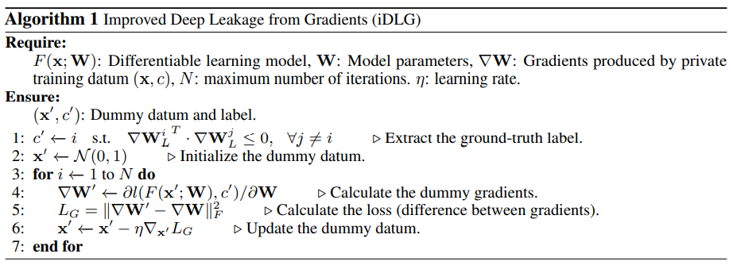

**存在问题：** 判断标签只能在 batch size = 1 的条件下进行。

##### See through Gradients: Image Batch Recovery via GradInversion[13]

文章在针对 mini-batch 的问题进行了改进，假设在 1000 分类的 ImageNet 数据集上训练时，每个 mini-batch 里采样得到的样本标签是各不相同的，在这样的假设下通过 iDLG 方法分析可得一个 mini-batch 中存在的标签对应的 $\nabla \mathbf{W}_L^i$ 平均值要小于其他位置，通过这种方式可以找到 mini-batch 中不同的标签。

## 联邦学习防御

## 拆分学习基本算法 Split Learning

联邦学习在本地需要训练一个完整的模型，这要求客户端拥有较多的计算资源，并且在与参数服务器协作训练时需要交互完整模型的梯度或模型参数导致通信量较大。在优化速度方面联邦学习优化算法没有建立在独立同分布假设下，即每个客户端拥有的数据可以是千奇百怪的，这导致模型需要拟合多个重叠度不高的分布到一个目标分布的映射关系，不满足现有机器学习的优化假设：数据独立同分布假设（Independent and Identically distributed，IID），优化效果和收敛速度都不好，因此产生了 Split Learning[5] 这种新的协作式机器学习方法。

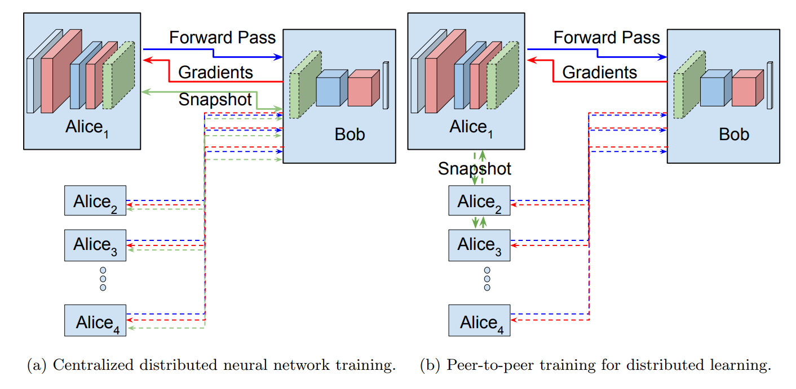

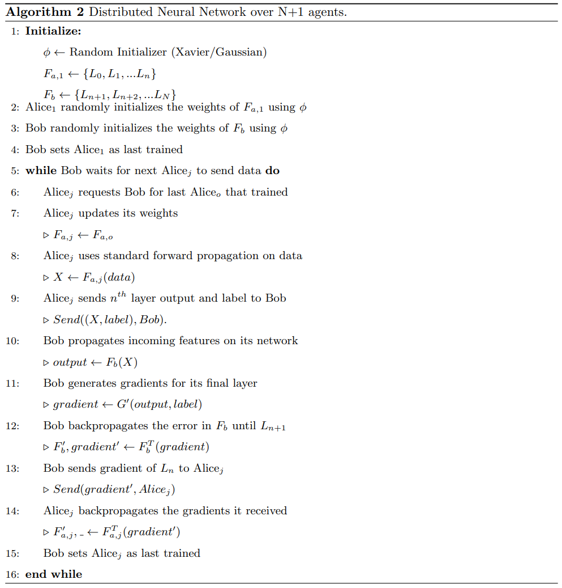

一般的 Split Learning 指的是串行化的拆分学习，即服务器分别与客户端协作训练一定轮数再与下一个客户端训练，这里上一个客户端要将自己与服务器协作训练过的本地网络参数移交给下一个客户端继续训练。这个过程与迁移学习类似，因此优化问题可以被规约为优化独立同分布假设下的分布映射问题（单一数据分布 --> 目标分布，如分类概率分布），这与集中式深度学习一致，因此串行的拆分学习的模型准确率要比联邦学习高。

在隐私保护角度上看，拆分学习将模型拆分为两个部分，本地客户端保存模型的浅层网络、服务端保存深层网络，前向计算过程中客户端向服务端上传浅层网络的激活结果（smashed data）服务端继续执行剩余网络的前向计算过程并计算损失、产生梯度，服务端产生的梯度向后传播给客户端，由客户端继续完成浅层网络的后向传播与更新。具体实现方法就是将反向传播的求导链式法则拆为两部分计算。这样服务端得不到客户端的原始数据而是 smashed data 因此起到隐私保护作用。

在有些场景下为了保护客户端的标签信息，也会将网络的头部保留在客户端用于计算损失函数，这样服务端就得不到标签信息，而它的主要任务就是训练网络的主干部分。

### 联邦拆分学习 SplitFed Learning

Split Learning 有一个很大的问题在于它并行化处理客户端数据，这样导致大多数客户端在同一时间处于空闲状态。为了提高拆分学习的效率，SplitFed Learning[6] 将联邦学习与拆分学习结合实现并行化训练模型。在这样的训练模式下，客户端并行地向服务端提供浅层网络的激活结果帮助训练服务端的深层网络，这一过程在服务端可以通过多线程实现，同时将梯度回传给客户端训练浅层网络。在固定轮数后服务端执行参数聚合，客户端借助联邦学习参数服务器执行安全聚合。

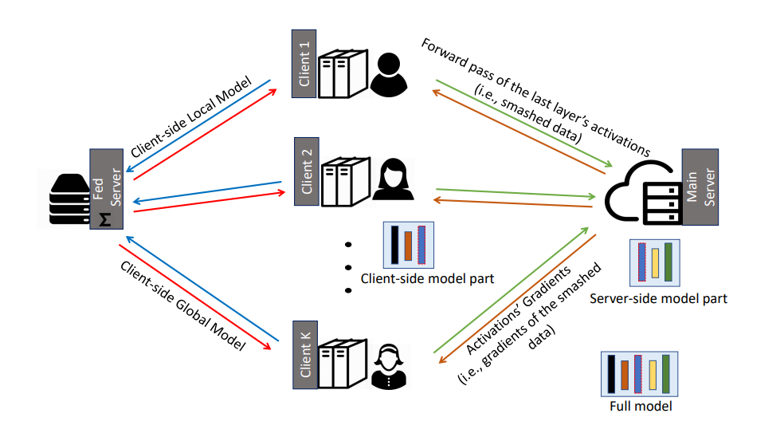

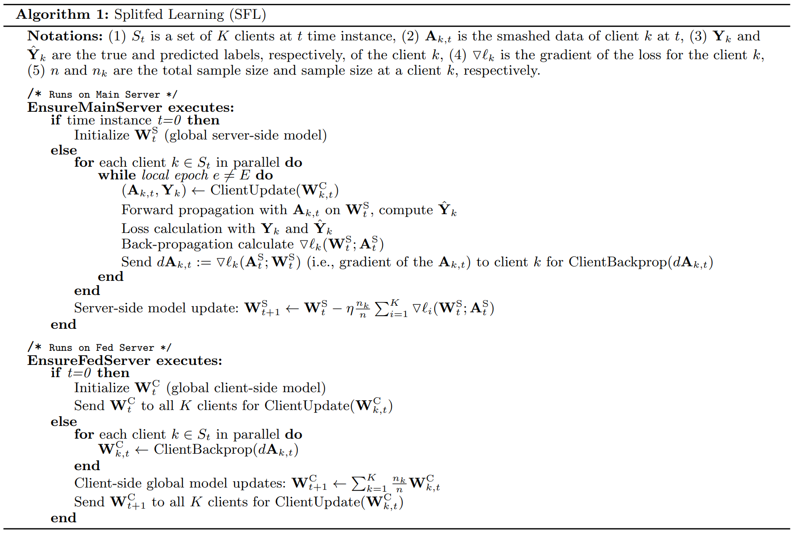

除了拆分学习固有的隐私保护性质，为了进一步保护数据隐私使原始数据不会从 smashed data 中泄露，联邦拆分学习在前向计算和后向传播过程中都使用了差分隐私（Differential Privacy）用于扰动模型参数。

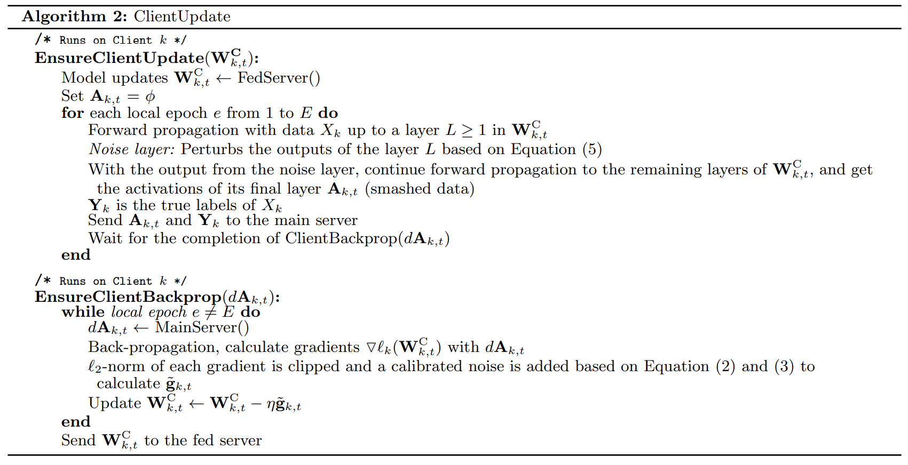
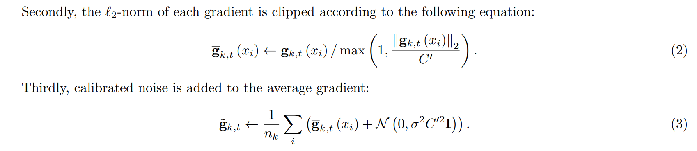
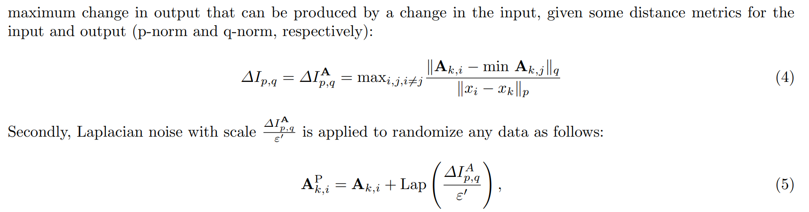

## 针对拆分学习的攻击问题

### 恶意服务端攻击

#### Training-based Model Inversion Attack（MIA）/ Black-box Attack

##### Single Inversion Model[7]

###### Threat Model

敌手完整拥有深层网络（可以没有计算损失函数的头部部分），能够得到客户端上传的 smashed data 但无法知道浅层网络结构和参数，能够得到与客户端参与训练的数据集有相似分布的数据集。

###### Method

在黑盒假设下的简单模型反转攻击思想是学习一个与客户端浅层网络无关联的网络，将 smashed data 映射到原始数据集分布中。假设浅层网络为$f_{\theta1}(.)$、反转网络为$f_{\theta2}(.)$，敌手可以获得与被攻击客户端有相似分布的数据集$X=(x_1,x_2,...,x_m)$，客户端数据集为$Y=(y_1,y_2,...,y_m)$（$X$与$Y$），敌手获得与$Y$对应的 smashed data $S=(f_{\theta1}(y_1),f_{\theta1}(y_2),...,f_{\theta1}(y_m))$，$f^{-1}_{\theta2}$的优化目标可以是其输出结果与被攻击数据集的 MSE 、SSIM 、PSNR 、Adversarial Loss。以 MSE 为例：

$$
f^{-1}_{\theta1} = \argmin_{f_{\theta2}}\sum^{m}_{i=1}||f_{\theta2}(f_{\theta1}(y_i)) - x_i||_2
$$

##### Feature Space Hijacking Attack[8]

###### Threat Model

敌手不能获得客户端的网络结构和参数，并且攻击过程忽略拆分学习训练的具体任务（因为不影响攻击过程，攻击过程理论上对任何任务都有效），敌手能够获取与客户端训练数据有相同或相似分布的公开数据集。

###### Method

特征图劫持攻击的主要思想是通过 GAN 控制训练过程使得 smashed data 特征空间映射到敌手指定的特征空间，并且敌手借助辅助数据集有能力将指定特征空间编码解码映射到被攻击的数据分布，从而起到恢复客户端数据的目的。

整个攻击过程可以分为两个步骤：

1. 训练过程：用 GAN 使 smashed data 对应的特征空间（分布）靠近敌手指定的特征空间（分布），敌手训练指定特征空间的解码器用以恢复隐私数据。[将浅层网络视为生成器，敌手搭建额外的判别器拉近两个分布的距离]
2. 推理过程：敌手用被劫持的浅层网络和训练得到的指定特征空间解码器恢复数据。

令$f$为客户端浅层网络，$\tilde{f}$为辅助数据集编码网络（将辅助数据分布映射到指定特征空间），$\tilde{f}^{-1}$为指定特征空间的解码器网络，$D$为敌手额外训练的判别器，$S$为正常任务的深层网络，$X_{priv}$,$X_{pub}$分别为客户端数据集和敌手拥有的公开辅助数据集，并且两者分布相似（比如都是人脸数据集）

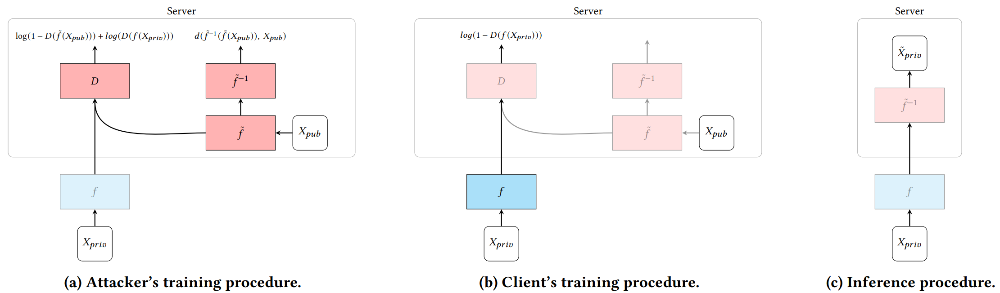

恶意服务端训练包含两个过程，首先利用辅助数据集$X_{pub}$训练 AutoEncoder 结构（$\tilde{f}$,$\tilde{f}^{-1}$）目的是将辅助数据集分布编码进特制的特征空间，并实现解码恢复，损失函数：

$$
\mathcal{L}_{\tilde{f}, \tilde{f}^{-1}}=MSE\left(\tilde{f}^{-1}\left(\tilde{f}\left(X_{p u b}\right)\right), X_{p u b}\right)
$$

其次，判别器被训练来区分来自$\tilde{f}$和来自客户端网络$f$的特征空间，损失函数：

$$
\mathcal{L}_D=\log \left(1-D\left(\tilde{f}\left(X_{p u b}\right)\right)\right)+\log \left(D\left(f\left(X_{p r i v}\right)\right)\right)
$$

敌手用判别器得到的梯度作为回传梯度给客户端浅层网络$f$，把$f$当作 GAN 中的生成器来训练，对应的损失函数：

$$
\mathcal{L}_f=\log \left(1-D\left(f\left(X_{\text {priv }}\right)\right)\right)
$$

推理过程敌手通过解码器将被特征空间被劫持的 smashed data 恢复为客户端数据：

$$
\tilde{X}_{\text {priv }}=\tilde{f}^{-1}\left(f\left(X_{p r i v}\right)\right)
$$

从攻击形式上看，特征图劫持攻击对带标签保护和未带标签保护的拆分学习都适用。同时也适用于属性推理攻击，实现方法是将解码器替换为指定被攻击属性的二分类器，即训练一个把指定特征空间映射到属性类别的概率分布。

从优化的角度上看，传统模型反转攻击是直接训练 smashed data 到原始数据分布的映射，这样的优化目标即使在有辅助先验知识的情况下也不太容易实现。这篇文章通过特征空间劫持、影响客户端训练过程的方式逼迫 smashed data 分布接近攻击者想要的分布，这样再进行模型反转攻击就容易得多，精度也能提高很多。

###### Result

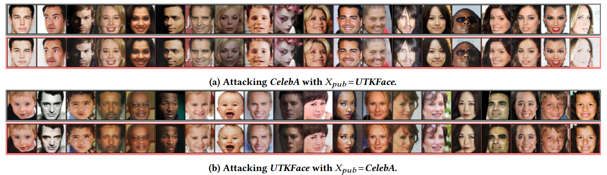

#### Optimization-based  Model Inversion Attack / White-box Attack

##### Regularized Maximum Likelihood Estimation[7]

###### Threat Model

敌手完整拥有深层网络（可以没有计算损失函数的头部部分），能够得到客户端上传的 smashed data 且知道浅层网络结构和参数。

###### Method

在白盒假设下，由于敌手获得了浅层网络反转攻击不需要优化一个网络，所以优化问题变为优化已知模型参数和 smashed data 得到的反推结果与原始数据的极大似然。假设$x$为敌手生成的数据、$x_0$为原始数据，浅层网网络为$f_{\theta1}$，对于图像数据可以借助先验知识：图像相邻像素点像素值大小相似，得到正则化极大似然优化公式：

$$
loss=\argmin_x||f_{\theta1}(x)-f_{\theta1}(x_0)||_2 + \lambda\sum_{i, j}\left(\left|x_{i+1, j}-x_{i, j}\right|^2+\left|x_{i, j+1}-x_{i, j}\right|^2\right)^{\beta / 2}
$$

其中正则项为全变分（Total Variation）模型，用来保持复原图像的平滑性。

### 恶意客户端攻击

#### GAN-based Gradient Leakage Attack

## 拆分学习防御

### Defending Based on Adversarial Training[9]

#### Threat Model

敌手（服务端）能够访问客户端模型并且知道客户端模型结构和参数，甚至知道客户端在执行拆分学习协议过程中的防御机制，因为敌手也可以在拆分学习协议中伪装成客户端出现。此外，敌手是 honest-but-curious 的，并且拥有计算复杂 inversion model 的能力。

#### Method

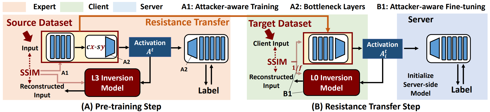

对抗训练抵御模型反转攻击的思路就是在客户端进行拆分学习训练过程中，在本地通过模拟模型反转攻击，客户端添加用于对抗模型反转攻击的损失函数，使得敌手训练 inversion model 难以成功。

假设$C_i$为第$i$个客户端，第$i$个客户端的反转模型为$D^i$，对应的参数为$W^{i}_{D}$，$D^i$接受中间层的激活值$A^i$生成重构图像$x^{*}_i$（就像服务端执行的模型反转攻击一样）,$\mathbb{R}$为重构损失（这里用的SSIM），$S$为服务端的深层网络，$W_s$为深层网络参数，$\lambda$为正则项，对抗训练过程优化：

$$
\min _{\boldsymbol{W}_C^i, \boldsymbol{W}_S} \max _{\boldsymbol{W}_D^i} \underbrace{\sum_{i=1}^N \mathcal{L}_{C E}\left(S\left(\boldsymbol{W}_S ; C^i\left(\boldsymbol{W}_C^i ; \boldsymbol{x}_i\right), \boldsymbol{y}_i\right)\right.}_{\text {Cross-Entropy Loss }}+\\
\lambda \times \underbrace{\sum_{i=1}^N \mathbb{R}\left(D^i\left(\boldsymbol{W}_D^i ; C^i\left(\boldsymbol{W}_C^i ; \boldsymbol{x}_i\right)\right), \boldsymbol{x}_i\right)}_{\text {Inversion Score }}
$$

此外，研究[10]表明更大维度的 smashed data 更有利于模型反转攻击。因此在浅层网络最后一层可以添加上瓶颈层（Bottleneck Layer，a pair of Conv2d）获得更稠密的 latent vector。图中的$Cx$-$Sy$表示 Bottleneck 卷积的通道数$x$和步幅$y$。

虽然对抗训练后期客户端可以建立比较好的防御，但在客户端建立这样一种对抗训练过程是困难的，特别是在训练早期客户端不能有效地提高敌手的重构损失，同样面临着很高的模型反转攻击的风险，并且客户端本身的计算资源有限不能有效地模拟复杂的模型反转攻击。因此作者采用迁移学习的方式，先在可信的有能力的设备上进行预训练对抗损失，然后在拆分学习初始化阶段迁移至客户端，初始化模型参数，在训练过程中进行 fine-tuning，保证对抗训练的防御效果保持在模型中同时微步提升模型准确率。

## Awesome Federated Learning

* [chaoyanghe/Awesome-Federated-Learning: FedML - The Research and Production Integrated Federated Learning Library: https://fedml.ai (github.com)](https://github.com/chaoyanghe/Awesome-Federated-Learning)
* [weimingwill/awesome-federated-learning: All materials you need for Federated Learning: blogs, videos, papers, and softwares, etc. (github.com)](https://github.com/weimingwill/awesome-federated-learning)
* [innovation-cat/Awesome-Federated-Machine-Learning: Everything about federated learning, including research papers, books, codes, tutorials, videos and beyond (github.com)](https://github.com/innovation-cat/Awesome-Federated-Machine-Learning)
* [google-research/federated: A collection of Google research projects related to Federated Learning and Federated Analytics. (github.com)](https://github.com/google-research/federated)   [Google Federated Learning Implement]

## Reference

[1] [Communication-Efficient Learning of Deep Networks from Decentralized Data](http://proceedings.mlr.press/v54/mcmahan17a/mcmahan17a.pdf)

[2] [Adaptive Federated Optimization](https://arxiv.org/abs/2003.00295)

[3] [FedCD: Improving Performance in non-IID Federated Learning](https://arxiv.org/abs/2006.09637)

[4] [Deep Models Under the GAN: Information Leakage from Collaborative Deep Learning](https://arxiv.org/pdf/1702.07464)

[5] [Distributed learning of deep neural network over multiple agents](https://arxiv.org/abs/1810.06060)

[6] [SplitFed: When Federated Learning Meets Split Learning](https://arxiv.org/abs/2004.12088)

[7] [Attacking and Protecting Data Privacy in Edge-Cloud Collaborative Inference Systems](https://ieeexplore.ieee.org/document/9187880/)

[8] [Unleashing the Tiger: Inference Attacks on Split Learning](https://arxiv.org/abs/2012.02670)

[9] [ResSFL: A Resistance Transfer Framework for Defending Model Inversion Attack in Split Federated Learning](https://arxiv.org/abs/2205.04007)

[10] [Querying Little Is Enough: Model inversion attack via latent information](https://link.springer.com/chapter/10.1007/978-3-030-62460-6_52)

[11] [Deep Leakage from Gradient](https://arxiv.org/abs/1906.08935)

[12] [iDLG: Improved Deep Leakage from Gradients](https://arxiv.org/abs/2001.02610)

[13] [See through Gradients: Image Batch Recovery via GradInversion](https://arxiv.org/abs/2104.07586)

